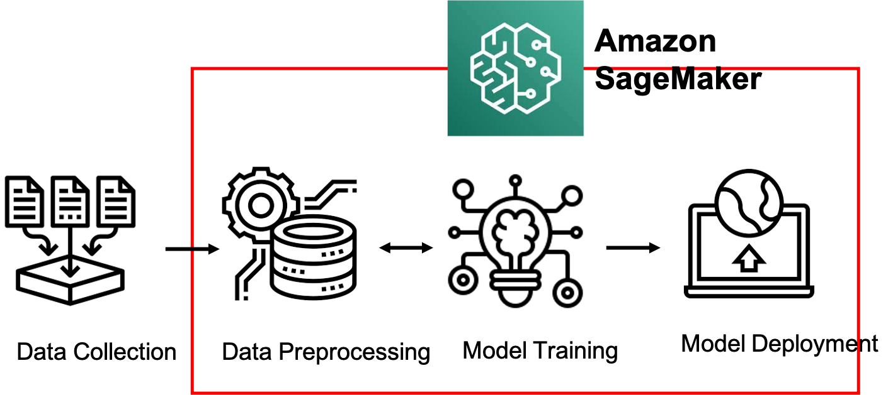

# image classification on amazon sagemaker studio

Amazon sagemaker is a universal tool for machine learning workflow.

## purpose

Using a public multi-class dataset, we will learn about data preprocessing, computer vision modeling, and model deployment on Amazon SageMaker Studio.

## types of modeling on amazon sagemaker studio